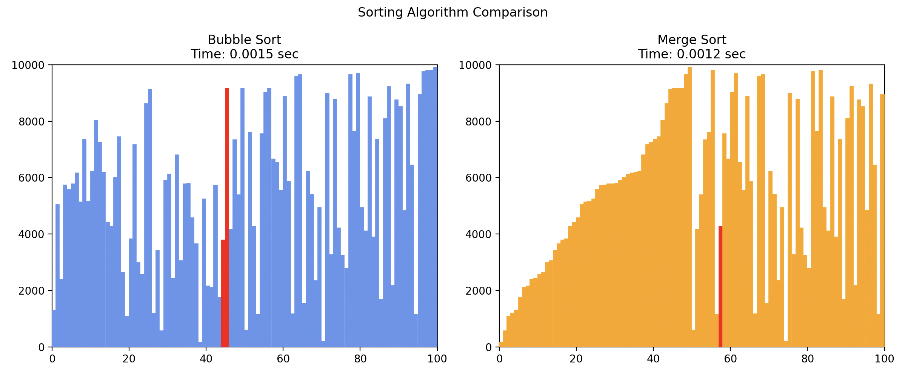

# Sorting Algorithm Visualization

Visualize and compare the performance of multiple sorting algorithms in Python using Matplotlib. This project provides an educational tool to understand how different sorting algorithms work, and how their efficiency varies with input size.

## Features

- Visualizes sorting steps for various algorithms
- Compare two algorithms side-by-side
- Timing comparisons using Python’s `time` module
- Easy to extend with additional sorting algorithms

## Algorithms Included

- Bubble Sort
- Insertion Sort
- Selection Sort
- (Add more here as you implement them!)

## Getting Started

### Prerequisites

- Python 3.7+
- Matplotlib

### Installation

Clone the repository:
```bash
git clone https://github.com/JDRailsback/Sorting-Algorithm-Visualization.git
cd Sorting-Algorithm-Visualization
```

Install dependencies:
```bash
pip install matplotlib
```

### Usage

Run the visualization script:
```bash
python main.py
```
Follow the prompts to select algorithms and input sizes.

## Example Output


*(Add a screenshot/gif here to show the visualizer in action)*

## Project Structure

- `main.py` — Entry point for running the visualizations
- `sorting_algorithms.py` — Contains sorting algorithm implementations
- `visualizer.py` — Handles plotting and animation
- `README.md` — This file

## Author

[JDRailsback](https://github.com/JDRailsback)

---

*Sorting-Algorithm-Visualization is an educational resource for learning and teaching sorting algorithms through interactive graphics and performance comparison.*